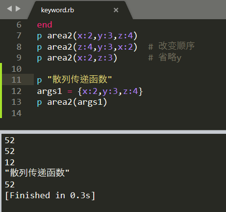

# 15.散列类（Hash）

## 15.1 散列类

散列与数组一样，都是表示对象计划的对象。数组通过索引访问对象内的元素，而散列是通过使用键。索引只能是数值，而键则可以是任意对象。通过使用键，散列就可以实现对元素的访问与赋值。

## 15.2 散列的创建

### 15.2.1 使用{}

```ruby
h1 = {"A"=>"a","B"=>"b"}
p h1["A"]  # =>  "a"
```

```ruby
h1 = {"A":"a","B":"b"}r
p h1[:A]   # => "a"
```

### 15.2.2 使用Hash.new

```ruby
h1 = Hash.new  # 默认值为nil
h2 = Hash.new("")
p h1
p h2
p h1["not_key"]
p h2["not_key"]
```


## 15.3 值得获取与设定

* h\[key\]
* h.store\(key,value\)
* h.fetch\(key\)

```ruby
h.store("R1","h = Hash.new
h["R"] = "Ruby"
p h["R"]
h.store("R1","Ruby1")
p h.fetch("R1")
# p h.fetch("U")  # 不存在的键会报错
p h.fetch("R2","(undef)")  # 防止出错指定返回值 可以理解为指定默认值
p h.fetch("R3"){String.new}
```


### 15.3.1一次性获取所有的键、值

可以使用each\_key和each\_value方法逐个获取并处理键、值

```ruby
h = {"a"=>"b","c"=>"d"}
p h.keys
p h.values
p h.to_a
```


### 15.3.2 散列的默认值

* **创建散列时指定默认值**—Hash.new的参数即为散列的默认值
* **指定生成散列默认值的块**—可以在Hash.new中指定块
* **用fetch指定**

```ruby
h = Hash.new(1)
h["a"]=10
p h["a"]
p h["b"]

h1 = Hash.new do |hash,key|
	hash[key] = key.upcase
end
h1["a"]= "b"
p h1["a"]
p h1["b"]
```


## 15.4 查看指定对象是否为散列的键或值

* **h.key?\(key\)**
* **h.has\_key?\(key\)**
* **h.include?\(key\)**
* **h.member?\(key\)**

```ruby
h = {"a"=>"b","c"=>"d"}
p h.key?("a")
p h.has_key?("c")
p h.include?("b")
p h.member?("d")
```



* h.value?\(value\)
* h.has\_value?\(value\)

```ruby
h = {"a"=>"b","c"=>"d"}
p h.value?("b")
p h.has_value?("a")
```


## 15.5 查看散列的大小

* **h.size**
* **h.length**
* **h.empty?**

```ruby
h = {"a"=>"b","c"=>"d"}
p h.length
p h.size
p h.empty?
h1 = Hash.new
p h1.empty?
```


## 15.6 删除键值

* **h.delete\(key\)**

```ruby
h = {"R"=>"Ruby","R1"=>"Ruby1"}
h.delete("R")
p h
# 如果没有可以通过块设置
h.delete("P"){|key| p "no #{key}"}
```


* **h.delete\_if{\|key,value\| ···}**
* **h.reject!{\|key,val\| ···}**

```ruby
h = {"R"=>"Ruby","P"=>"Python"}
p h.delete_if{|key,value| key == "P"}
p h.delete_if{|key,value| key == "L"}
p h.reject!{|key,value| key == "L"}
```


## 15.7 初始化散列

* **h.clear**

```text
h = {"a"=>"b","c"=>"d"}
h.clear
p h.size # => 0
# 等价于
h = Hash.new
```

### 处理有两个键的散列

```ruby
table = {"A"=>{"a"=>"x","b"=>"y"},
		 "B"=>{"a"=>"v","b"=>"w"}}
p table["A"]["a"]
p table["B"]["a"]
```


## 15.8 合并两个散列

使用Hash\#merge方法可以合并两个散列，创建一个新的散列。

```ruby
p ({"a"=>"x"}).merge({"b"=>"y"})
```


## 15.9 计算单词数量

```ruby
# 计算单词数量
count = Hash.new(0)

## 统计单词
File.open("TheNewColossus.txt") do |f|
	f.each_line do |line|
		words = line.split
		words.each do|word|
			count[word]+=1
		end
	end
end
# 输出结果
count.sort{|a,b|
	a[1]<=>b[1]
}.each do |key,value|
	p "#{key} : #{value}"
end
```


